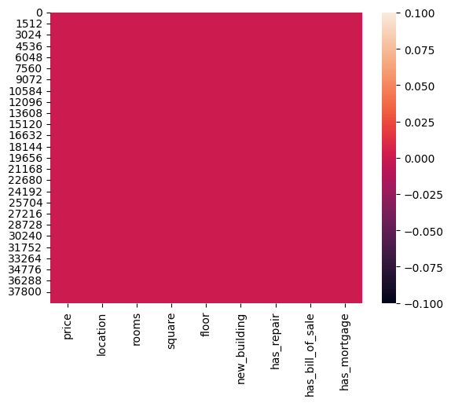
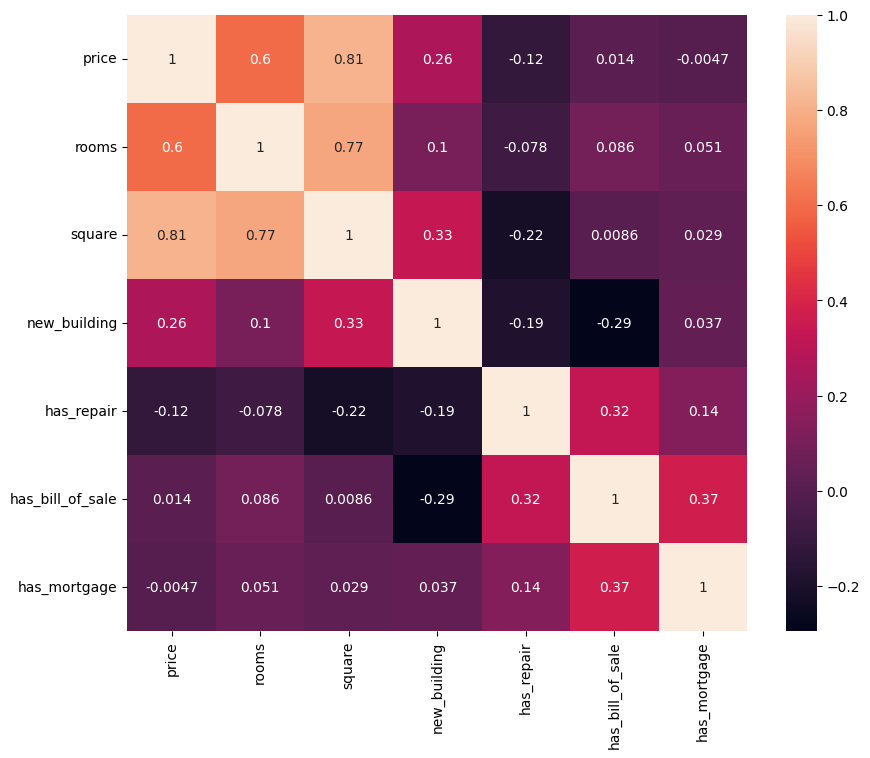
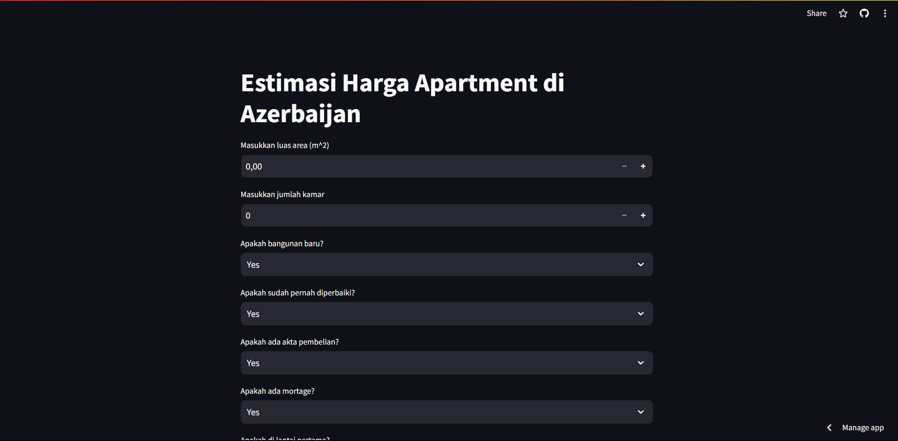

# Laporan Proyek Machine Learning
### Nama : Muchammad Romadona
### Nim : 211351085
### Kelas : Malam B

## Domain Proyek

Estimasi harga apartment ini boleh digunakan sebagai patokan bagi semua orang yang ingin pindah/bekerja/melanjutkan study di Azerbaijan, atau juga bisa digunakan bagi kalian yang suka mengumpulkan asset-asset berbentuk property/apartment. 

## Business Understanding

Bisa menghemat waktu serta biaya agar tidak pergi ke Azebaijan terlebih dahulu baru menanyakan harga/specifikasi apartment.

Bagian laporan ini mencakup:

### Problem Statements

- Ketidakmungkinan bagi seseorang untuk mengunjungi masing-masing lokasi apartment dan menanyakan harga apartment yang ada di Azerbaijan. 

### Goals

- mencari solusi untuk memudahkan orang-orang yang mencari patokan harga apartemen di Azerbaijan.

### Solution statements
- Pengembangan Platform Pencarian Patokan Harga Apartment Berbasis Web, Solusi pertama adalah mengembangkan platform pencarian harga apartment berbasis web yang mengintegrasikan data dari Kaggle.com untuk memberikan pengguna akses cepat dan mudah ke informasi tentang estimasi harga apartment di Azerbaijan. Platform ini akan menyediakan antarmuka pengguna yang ramah, memungkinkan pengguna mencari harga apartment berdasarkan kriteria tertentu seperti lokasi, luas area, dan jumlah kamar. 
- Model yang dihasilkan dari datasets itu menggunakan metode Linear Regression.

## Data Understanding
Dataset yang saya gunakan berasal jadi Kaggle yang berisi harga apartment di Azerbaijan. Dataset ini merupakan sekumpulan data yang dikumpulkan dari website real estate populer yang ada di Azerbaijan. Dataset ini mengandung 39,300 baris dan lebih dari 10 columns setelah dilakukan data cleaning..<br> 

[Apartment Prices for Azerbaijan Market](https://www.kaggle.com/datasets/azadshahvaladov/apartment-prices-for-azerbaijan-market).


### Variabel-variabel pada Apartment Prices for Azerbaijan Market adalah sebagai berikut:
- Price            : Menunjukkan harga apartment. [Numbers, Min: 9600, Max: 8.07M]
- Location         : Menunjukkan lokasi apartment.[String, İnşaatçılar m., Nəriman Nərimanov m., Nəsimi r., Şah İsmayıl Xətai m., Həzi Aslanov m.]
- Rooms            : Menunjukkan jumlah kamar.    [Numbers, Min: 1, Max: 20]
- Square           : Menunjukkan luas apartment.  [Numbers, Min: 12, Max: 1.6k]
- Floor            : Menunjukkan apartment berada di lantai berapa. [Numbers, Min: 1, Max: 19]
- New Building     : Menunjukkan keterangan apakah apartment berada di bangunan baru [Boolean, True: 1, False: 0]
- Has Repair       : Menunjukkan keterangan apakah apartment pernah menjalani perbaikan sebelumnya [Boolean, True: 1, False: 0]
- Has Bill of Sale : Menunjukkan apakah apartment ada akta pembelian [Boolean, True: 1, False: 0]
- Has Mortgage     : Menunjukkan apakah apartment ada perjanjian pinjaman dengan bank/lembaga keuangan. [Boolean, True: 1, False: 0]

## Data Preparation
### Data Collection
Untuk data collection ini, saya mendapatkan dataset yang nantinya digunakan dari website kaggle dengan nama dataset Apartment Prices for Azerbaijan Market, jika anda tertarik dengan datasetnya, anda bisa click link diatas.

### Data Discovery And Profiling
Untuk bagian ini, kita akan menggunakan teknik EDA. <br>
Pertama kita mengimport semua library yang dibutuhkan, 
``` bash
import pandas as pd
import numpy as np
import matplotlib.pypot as plt
import seaborn as sns
```

Karena kita menggunakan google colab untuk mengerjakannya maka kita akan import files juga,
``` bash
from google.colab import files
```

Lalu mengupload token kaggle agar nanti bisa mendownload sebuah dataset dari kaggle melalui google colab
``` bash
file.upload()
```
Setelah mengupload filenya, maka kita akan lanjut dengan membuat sebuah folder untuk menyimpan file kaggle.json yang sudah diupload tadi
``` bash
!mkdir -p ~/.kaggle
!cp kaggle.json ~/.kaggle/
!chmod 600 ~/.kaggle/kaggle.json
!ls ~/.kaggle
```
Done, lalu mari kita download datasetsnya
``` bash
!kaggle datasets download -d azadshahvaladov/apartment-prices-for-azerbaijan-market
```
Selanjutnya kita harus extract file yang tadi telah didownload
``` bash
!unzip apartment-prices-for-azerbaijan-market.zip -d apartment
!ls apartment
```
Mari lanjut dengan memasukkan file csv yang telah diextract pada sebuah variable, dan melihat 5 data paling atas dari datasetsnya
``` bash
df = pd.read_csv("apartment/BakuApartmentData.csv")
df.head()
```
Karena di dalamnya terdapat satu kolom yang tidak kita inginkan, maka kita akan drop satu kolom itu,
``` bash
column_to_drop = 'Unnamed: 0'
df = df.drop(columns=[column_to_drop])
```
Untuk melihat mengenai type data dari masing masing kolom kita bisa menggunakan property info,
``` bash
df.info()
```
Selanjutnya kita akan memeriksa apakah datasetsnya terdapat baris yang kosong atau null dengan menggunakan seaborn,
```  bash
sns.heatmap(df.isnull())
```
 <br>
Terlihat aman yak!

Mari kita lanjut dengan data exploration kita,
``` bash
plt.figure(figsize=(10,8))
sns.heatmap(df.corr(), annot=True)
```

hmm...untuk berjaga-jaga mari kita check apakah terdapat duplicate data di datasets kita,
``` bash
df[df.duplicated()]
```
mari drop semua data duplicate,
``` bash
df.drop_duplicates(inplace=True)
```
okei sudah aman, mari lanjut. Di lokasi terdapat huruf ".m", ".q", ".r", mari kita pisahkan itu dan masukkan kedalam sebuah kolom baru,
``` bash
df['location_m_q_r'] = df.location.str.split().str[-1].str.replace('.', '')
df['location'] = df['location'].str.replace('m.', '').str.replace('q.', '').str.replace('r.', '').str.strip()
```
Kita bisa melihat hasilnya dengan melakukan command ini,
``` bash
print(df.location_m_q_r)
print(df.location)
```
Selanjutnya kita akan memisahkan apartment yang terletak pada lantai pertama dan lantai paling atas
``` bash
df['first_floor'] = (df.floor.str.split('/').str[0] == '1').astype(int)
print(df.first_floor.value_counts())
df['last_floor'] = (df.floor.str.split('/').str[0] == df.floor.str.split('/').str[-1]).astype(int)
print(df['last_floor'].value_counts())
df = df.drop(['floor'], axis=1)
```
nah sudah terpisahkan, mari kita lihat harga rata-rata dari first_floor, last_floor and in between,
``` bash
print('Avarage apartment prices located on last floor:', df[df['last_floor'] == 1]['price'].mean())
print('Avarage apartment prices located on first floor:', df[df['first_floor'] == 1]['price'].mean())
print('Avarage apartment prices not located on last and first floor:', df[(df['last_floor'] == 0) & (df['first_floor'] == 0)]['price'].mean())
```
wow, tidak terasa proses data exploration dan cleansing sudah dilaksanakan, mari lanjut dengan modeling.

## Modeling
sebelumnya mari kita import library yang nanti akan digunakan,
``` bash
from sklearn.model_selection import train_test_split
from sklearn.linear_model import LinearRegression
```
Langkah pertama adalah memasukkan kolom-kolom fitur yang ada di datasets dan juga kolom targetnya,
 ``` bash
features = ['square', 'rooms', 'new_building', 'has_repair', 'has_bill_of_sale', 'has_mortgage', 'first_floor', 'last_floor', 'location_m_q_r']
X = df[features]
y = df.price
 ```
Selanjutnya kita akan menentukan berapa persen dari datasets yang akan digunakan untuk test dan untuk train, disini kita gunakan 20% untuk test dan sisanya untuk training alias 80%
``` bash
X_train, X_test, y_train, y_test = train_test_split(X, y, test_size=0.2, random_state=42)
```
Mari kita lanjut dengan membuat model Linear Regressionnya
``` bash
model = LinearRegression()
```
nah, sebelum kita memasukkan X_train dan y_train pada model, kita harus konvert q, r, dan m menjadi integer terlebih dahulu agar nanti bisa dijadikan angka untuk diproses oleh modelnya
``` bash
df['location_m_q_r'] = df['location_m_q_r'].map({'q': 0, 'r': 1, 'm': 2}).astype(int)
```
okeh mari lanjut, memasukkan X_train dan y_train pada model dan memasukkan value predict pada y_pred,
``` bash
model.fit(X_train, y_train)
y_pred = model.predict(X_test)
```
nah, selesai, sekarang kita bisa melihat score dari model kita,
``` bash
score = model.score(X_test, y_test)
print(f"this has {score} of score")
```
Lumayan juga ya, 71.14%, alright mari kita test menggunakan sebuah array value
``` bash
input_data = np.array([[245, 3, 1, 1, 1, 1, 1, 0, 2]])
prediction = model.predict(input_data)
print('Estimasi harga apartment di azerbaijan dalam Manat : ', prediction)
```
wow, berhasil!!, sekarang modelnya sudah selesai, mari kita export sebagai sav agar nanti bisa kita gunakan pada project web streamlit kita.
``` bash
import pickle

filename = "estimasi_apartment.sav"
pickle.dump(model,open(filename,'wb'))
```


## Evaluation
Disini saya menggunakan F1 score sebagai metrik evaluasi.
- F1 Score: F1 score adalah rata-rata harmonis antara presisi dan recall. F1 score memberikan keseimbangan antara presisi dan recall. F1 score dihitung dengan menggunakan rumus: <br> 
$$2*(P*R/P+R)$$

- Setelah itu saya menerapkannya dalam kode menggunakan fungsi f1_score, seperti berikut :
``` bash 
from sklearn.metrics import precision_recall_curve, f1_score

threshold = 200000

y_pred_binary = (y_pred > threshold).astype(int)
y_test_binary = (y_test > threshold).astype(int)

f1 = f1_score(y_test_binary, y_pred_binary)

print('F1 Score:', f1)
```
dan hasil yang saya dapatkan adalah 0.8464991023339318 atau 84.6%, itu berarti model ini memiliki keseimbangan yang baik antara presisi dan recall. Karena kita mencari patokan harga untuk membeli Apartment maka model yang presisi sangat dibutuhkan agar kemungkinan terjadinya kesalahan semakin sedikit.

## Deployment

[My Estimation App](https://estimation-application-with-dontkeep.streamlit.app/).



